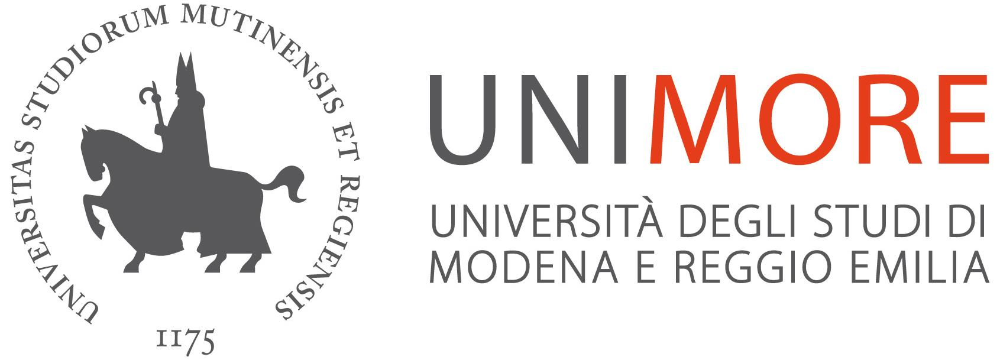
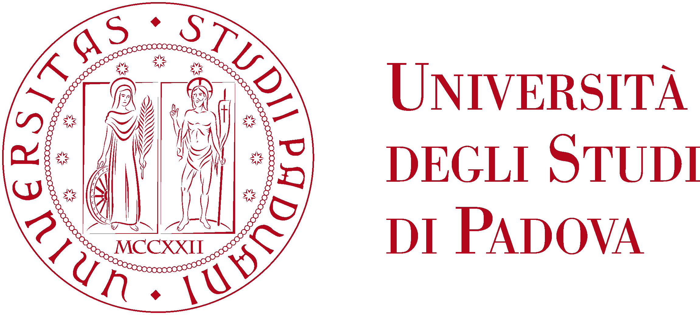



# CATHY days 2026

We are thrilled to announce that in **2026** we will renew the tradition and organise the <b>CATchment HYdrology (CATHY) days</b>!

  
  <small><i>[1]</i></small>

## About this event

This informal meeting will bring together researchers interested in or working on topics connected to **integrated surface-subsurface hydrological modeling**.

The meeting will be focused on a number of talks that will address current progress and challenges in coupled surface–subsurface hydrological modeling, solute transport modeling, data assimilation, and catchment hydrology at large. Plus, we'll make sure plenty of time is left for open discussion.

## Key dates

  <strong>⚠️ Registration deadline:</strong> March 31st, 2026 
  <strong>📅 Seminar days:</strong> July 3rd, 2026

## Registration

There is no registration fee for the workshop; however, the number of **in-person participants is limited to 40**, due to the maximum capacity of the venue. Therefore, respondents will be assigned a spot on a first-come-first-serve basis.

Want to join? [Registration are open](https://saco.csic.es/apps/forms/s/naAyMppTzXwKPdssZeDPfKrY)!

## Venue: Modena (IT)

  📍 The workshop will be held at the <strong>Department of Engineering "Enzo Ferrari"</strong> 
  <a href="https://maps.app.goo.gl/HpBkeiKqQnsJjVPq6" target="_blank">Via Vivarelli 10, 41125 Modena (IT)</a>

 

<iframe src="https://www.google.com/maps/embed?pb=!1m18!1m12!1m3!1d2836.4!2d10.9481!3d44.6285!2m3!1f0!2f0!3f0!3m2!1i1024!2i768!4f13.1!3m3!1m2!1s0x477fef3b2b5b5b5b%3A0x1!2sVia+Vivarelli+10%2C+41125+Modena!5e1!3m2!1sen!2ses" width="100%" height="380" style="border:0; border-radius:8px;" allowfullscreen="" loading="lazy" referrerpolicy="no-referrer-when-downgrade"></iframe>

## How to get there

<table class="transport-table">
  <thead>
    <tr>
      <th>Mode</th>
      <th>From</th>
      <th>Details</th>
    </tr>
  </thead>
  <tbody>
    <tr class="tr-train">
      <td>🚆 Train</td>
      <td><strong>Bologna Centrale</strong></td>
      <td>Direct regional trains to <em>Modena station</em> run every 20–30 min (~25 min journey). From Modena station, the Engineering Department is a 15-min walk or a short taxi/bus ride.</td>
    </tr>
    <tr class="tr-train">
      <td>🚆 Train</td>
      <td><strong>Milano Centrale</strong></td>
      <td>High-speed trains (Frecciarossa/Italo) to <em>Bologna</em> (~1 h), then regional to Modena. Alternatively, direct intercity trains to Modena (~1 h 40 min).</td>
    </tr>
    <tr class="tr-plane">
      <td>✈️ Plane</td>
      <td><strong>Bologna Airport (BLQ)</strong></td>
      <td>Closest international airport (~40 km). Take the Marconi Express to Bologna Centrale (~7 min), then a regional train to Modena (~25 min). Total door-to-door ≈ 1 h.</td>
    </tr>
  </tbody>
</table>

## Sponsors 🙌

  <!-- UNIMORE -->
  

  <!-- UNIPD -->
  

## Useful links

<a href="https://github.com/CATHY-Org">Github CATHY group organisation</a>

<small><i>[1] Camporese et al. 2019 [10.1029/2019WR025726, fig. 6]</i></small>

## Contact

Interested in participating? Get in touch with a committee member directly.


{{ macros.make_people_list(page.people.current) }}

